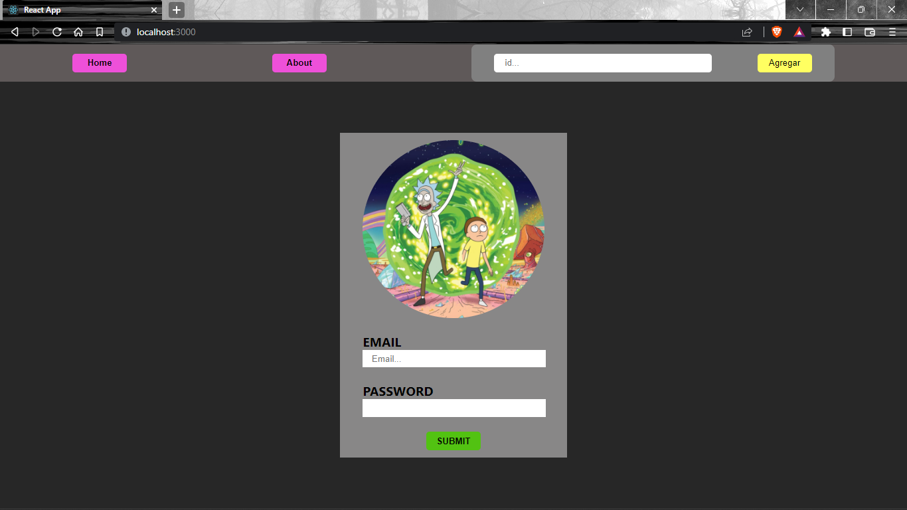
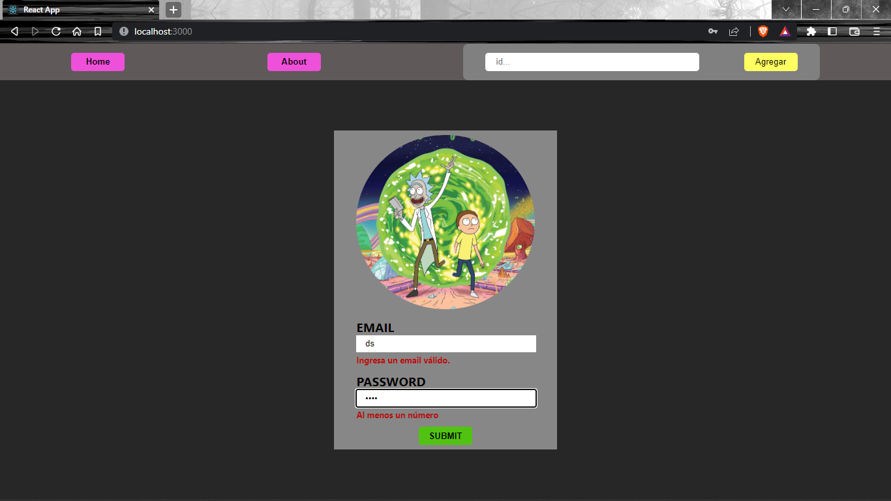

# **💪 HW10 | React Forms - Integration**

## **🕒 DURACIÓN ESTIMADA**

3 horas

<br />

---

<div align="center">

## **💻 RICK AND MORTY APP 💻**

</div>

## **📝 INTRODUCCIÓN**

En esta homework crearemos un sistema de login para nuestra aplicación. De esta forma podremos practicar formularios y, además, cada vez que ingresemos a la App tendremos que tener un email y una contraseña.

<br />

---

## **📋 INSTRUCCIONES**

### **👩‍💻 EJERCICIO 1 | Form**

Ahora crearemos el formulario que nos permitirá logearnos en un futuro.

1. Crea un componente con el nombre **`Form`**.
2. Dentro de este componente se deben renderizar los siguientes elementos:

   -  Una etiqueta **`form`** que envolverá a todo el componente.
   -  Una etiqueta **`label`** junto con un **`input`** para el email.
   -  Una etiqueta **`label`** junto con un **`input`** para la password.
   -  Un **`button`** con el texto "**_Submit_**".

¡Dale algo de estilos al componente! Puede quedar algo como esto...



<br />

---

### **👩‍💻 EJERCICIO 2 | Routing**

Ahora le diremos a nuestro formulario dónde debe renderizarse. Para esto:

1. Crea una ruta en el archivo **`App.js`** y crea una ruta para que el formulario se renderice en **`/`**.
2. Si obervas la imagen del ejercicio anterior, la barra de navegación aún se muestra en el **login**. Deberás crear un renderizado condicional, de modo tal que la **`Nav`** se muestre siempre y cuando no estemos en la ruta **`/`**.

> **PISTA:** investiga sobre el hook **`useLocation`** de react-router-dom, y piensa cómo hacer el renderizado condicional.

<br />

---

### **👩‍💻 EJERCICIO 3 | Form control**

En este ejercicio controlaremos y gestionaremos la información que ingrese el usuario en nuestro formulario. Para esto:

1. Crea un estado local llamado **userData**. Este debe inicializarse como un objeto con las propiedades **email** y **password** iguales a un string vacío.
2. Conecta tu estado local con los inputs correspondientes utilizando la propiedad **`value`**.
3. Crea una función llamada **handleChange** que nos permita reflejar el texto ingresado de los inputs en nuestro estado local.

<br />

---

### **👩‍💻 EJERCICIO 4 | Validaciones**

1. En tu componente **`Form`** crea un nuevo estado local llamado "**errors**" que se inicialice como un objeto vacío. Este es el estado que utilizarás para encontrar errores en el formulario.

2. Ahora crea un archivo con el nombre "**validation.js**". Aquí dentro deberás crear una función que valide los siguientes puntos:

**EMAIL**

-  el nombre de usuario tiene que ser un email (¡Explora validaciónes REGEX en internet!).
-  el nombre de usuario no puede estar vacío.
-  el nombre de usuario no puede tener más de 35 caracteres.

**PASSWORD**

-  la contraseña tiene que tener al menos un número.
-  la contraseña tiene que tener una longitud entre 6 y 10 caracteres.

¡No te olvides de renderizar y darle estilos a tus errores! Te dejamos un ejemplo de cómo puede quedar.



<br />

---

### **👩‍💻 EJERCICIO 5 | Seguridad**

Ahora simularemos una base de datos donde esté guardado un email y password. De esta forma, solo si la información de usuario coincide podrá ingresar a la aplicación. Para esto:

1. En el archivo **`App.js`** crea lo siguiente:

   -  Un estado local llamado "**access**" que se inicialice en **`false`**.
   -  Una variable llamada "**EMAIL**", y que sea igual a tu email.
   -  Una variable "**PASSWORD**", y que sea igual a una contraseña.

</br >

2. Crea una función llamada "**login**" que reciba por parámetro "_userData_". Esta función tiene que preguntar si el email y password que declaraste más arriba son iguales a los que les está llegando por parámetro. En caso afirmativo, el estado local access ahora será **`true`**. Importa el hook "**useNavigate**" de _react-router-dom_ y haremos que nos redirija a **`/home`** si la información es correcta.

```jsx
const navigate = useNavigate();
const [access, setAccess] = useState(false);
const EMAIL = 'ejemplo@gmail.com';
const PASSWORD = 'unaPassword';

function login(userData) {
   if (userData.password === PASSWORD && userData.email === EMAIL) {
      setAccess(true);
      navigate('/home');
   }
}
```

3. Por último, lleva el siguiente código a tu componente (no te olvides de importar el **`useEffect`**).

```javascript
// App.js
useEffect(() => {
   !access && navigate('/');
}, [access]);
```

<br />

---

### **👩‍💻 EJERCICIO 6 | Login**

¡Ahora le daremos la funcionalidad de cambiar los permisos a nuestro login!

1. Dirígete al archivo **`App.js`** y pásale la función **login** que creaste en el ejercicio anterior al componente **`Form`** mediante props.

2. En el componente **`Form`** crea una función "**handleSubmit**". Esta función recibe un evento por parámetro. Deberás ejecutas la función **`e.preventDefault()`**. Luego ejecuta la función "**login**" recibida por props. ¡No te olvides de pasarle por parámetro tu estado local _`userData`_!

3. La función **handleSubmit** debe ejecutarse cuando se hace click en el botón **submit**.

¡Listo! Ya tienes un login funcional 😀🥳🤓

Pruebalo ingresando la información que declaraste previamente.

<br />

---

### **📌 EJERCICIO EXTRA**

Te desafiamos a que crees un botón "**Log out**" en tu componente **`Nav`**. Si lo presionas debe quitar los permisos de acceso y redirigirte automáticamente a tu componente **`Form`**.

> [**NOTA**]: lo puedes hacer creando una función **logout** en tu archivo App.js.
